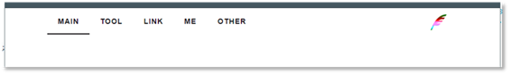
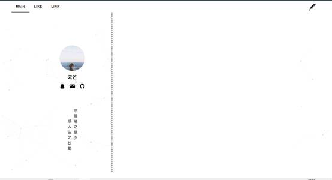
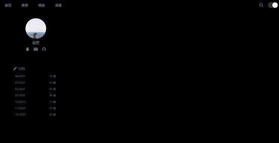

## 2021/3/7 

1. 完成数据库建表、录入数据

2. 完成前端、后端、数据库的设计、规划

 

## 2021/3/8

1. 批量录入测试数据，将markdown文件存储到数据库中

2. 编写API接口，实现文章列表、指定文章的查询

3. 编写前端内容

   a)   建构前端框架

   b)   引入element-ui

   c)   引入iconfont

   d)   引入global.scss

   e)   完成部分navgation导航栏操作，封装jumpto方法实现导航栏路由跳转

   f)   实现导航栏logo渐变色

 

 

 

## 2021/3/13

1. 设计页面背景：

> https://vue-particles.netlify.app/

> https://www.vantajs.com/

2. 重写nav导航栏的结构，将item写入data中

3. 删除TOOL、ME、OTHER等无关导航路由

4. 编写首页分栏，分为用户信息页和内容展示页面

5. 编写用户信息展示页面，将用户名、邮箱地址、QQ、Github地址抽象到ENV中，并完成用户信息侧边栏的编写

6. 解决了element导航栏默认只加载第一个，刷新页面后路由和标签不匹配的BUG

 

 

## 2021/4/5

1. 删除particles.js vanta.js等特效

2. 删除ElementUI组件库

3. 启用tailwind.css

4. 重写导航栏nav

5. 删除link，准备添加到网站主页右侧

6. 重写personinfo

7. 重写timeline用于展示每个月发表的文章数目

8. 增加暗黑模式

9. 完成顶部搜索框以及交互动画的编写

10. Fix BUG Visual Studio Code CSS linting with Tailwind

> https://www.meidev.co/blog/visual-studio-code-css-linting-with-tailwind/

## 2021/4/12

- 页面重新设计
- 文章排版
- 热门推荐
- 友情链接
- 暗黑模式优化
- 造数据库假数据
- 测试后端接口
- 渲染Markdown：https://www.cnblogs.com/youxam/p/vue-markdown-render.html
- 编写markdown样式 markdown.scss
- 优化网站咨询、优化归档、优化API接口数据结构

待解决：

- 利用timeline过滤文章
- 利用search过滤文章
- 推荐页面
- 精选页面
- 消遣页面

